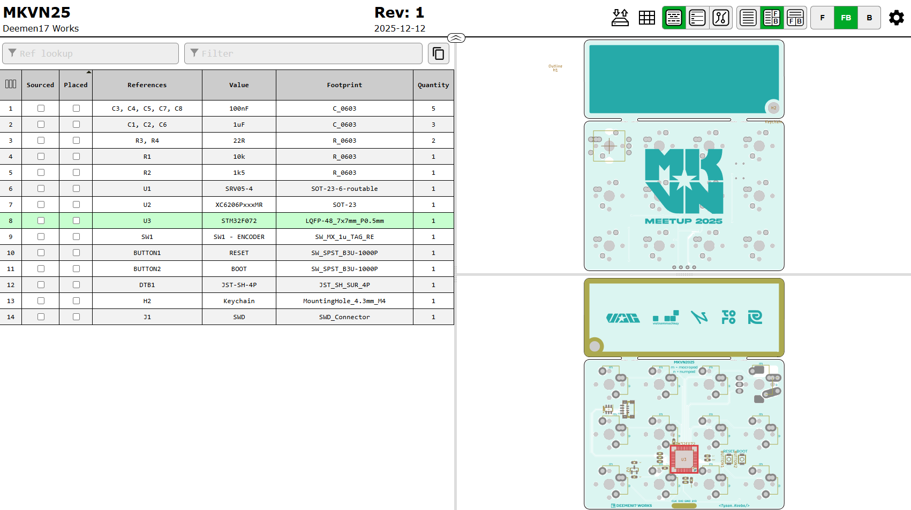
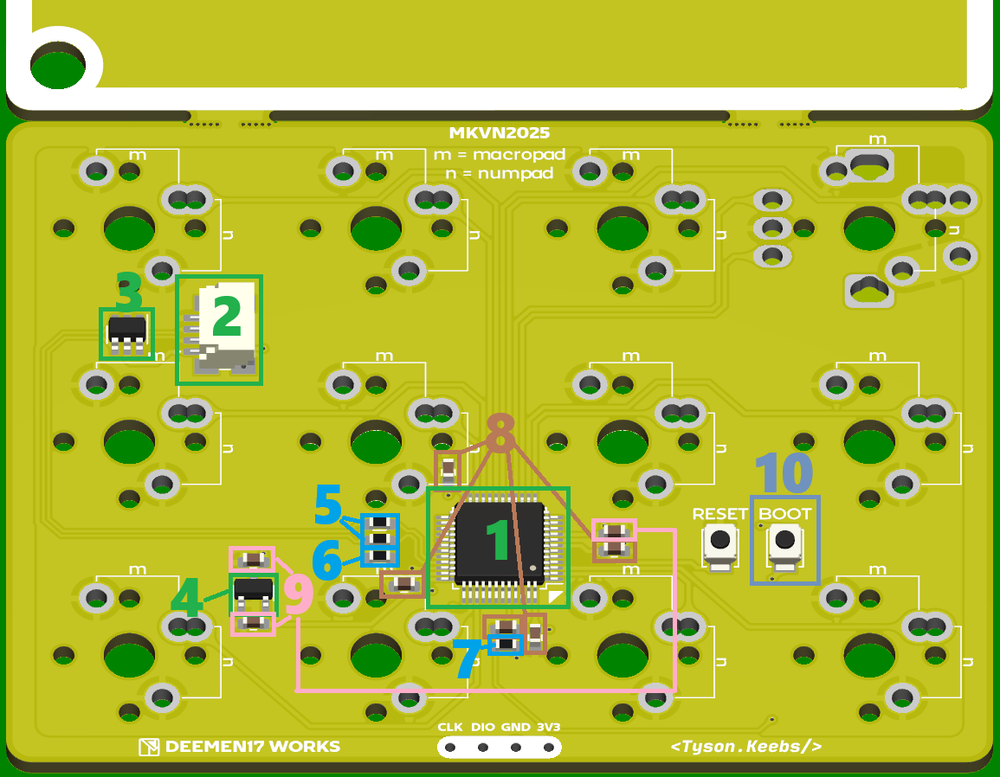
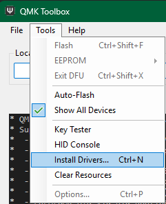
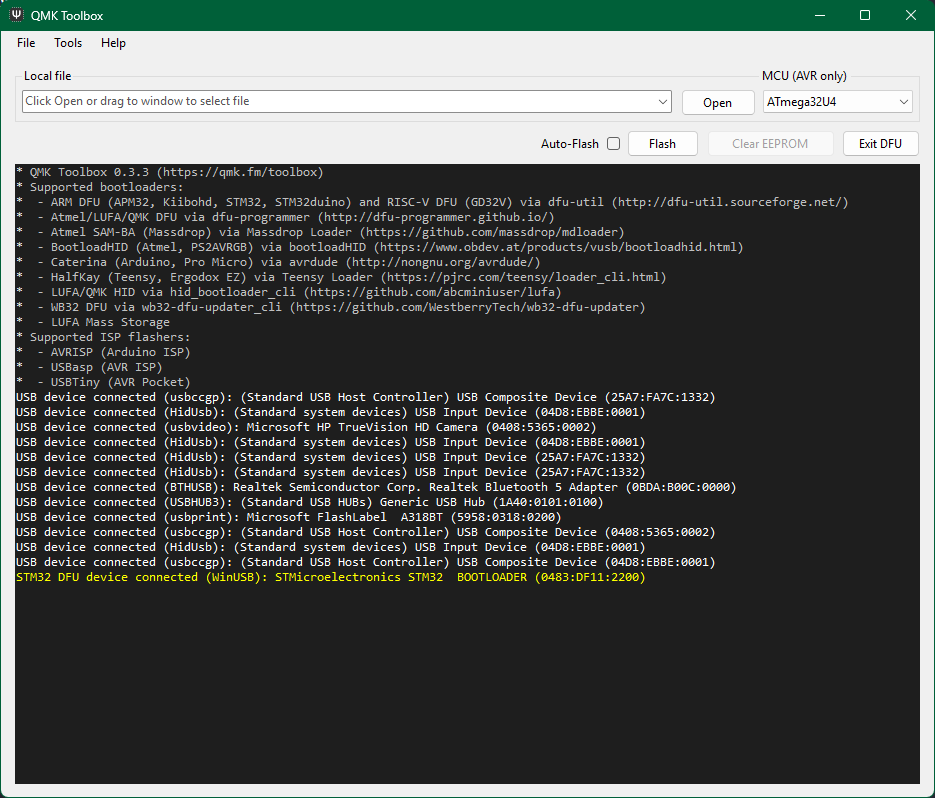
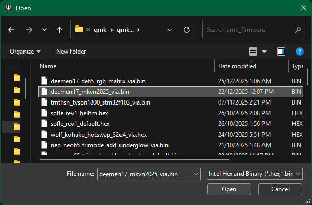
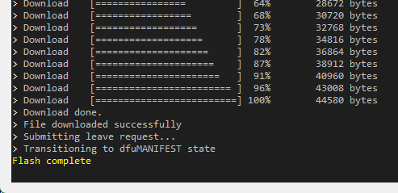

# 📛 MKVN25 PCB Assembly Guide  
**by DEEMEN17 WORKS**

---

## Introduction

The **MKVN25 PCB** is an electronic circuit board designed as a **PCB Badge** for the **MKVN Meetup 2025** event.

The PCB comes in **three color variants**, corresponding to different participant categories:
- **Gold** – **Premium Ticket** holders
- **Black** – **Vendors / Invited Guests**
- **Red** – **Organizing Team**

All three variants are **identical in design and functionality**.  
This guide can be used to assemble **any color version** of the MKVN25 PCB.

The PCB is designed with **two separate sections**:
- Name tag section
- Main PCB section

---

## Name Tag Section

The name tag section can be:
- Snapped off and used as a **decorative keychain**
- Used as a **nametag / timestamp** when photographing products

To clean marker ink from the PCB surface, you may use:
- Alcohol
- IPA
- Acetone
- Dedicated PCB cleaning solutions

---

## Main PCB Section

This is the functional core of the MKVN25 PCB.

The main PCB supports **two usage layouts**:
- **Macropad** (3 columns × 4 rows)
- **Numpad** (4 columns × 3 rows)

By default, the PCB is delivered **without pre-soldered components**.  
You may:
- Source the components yourself based on the BOM
- Or contact **DEEMEN17 WORKS** to purchase a **complete component kit**

---

## 🛠 Preparation

### Hardware
- Solder wire
- Fine-tip soldering iron
- Hot air rework station (for solder paste users)
- Flux
- Tweezers
- Brass wool / sponge
- Multimeter

### Software
- Web browser
- iBOM file: [`MKVN2025.html`](/ibom/MKVN2025.html)
- **QMK Toolbox** (with drivers installed)
- **VIA** or **VIAL** web application

---

## 👉 Assembly Steps

### Step 1: Open the iBOM File

- Download [`MKVN2025.html`](/ibom/MKVN2025.html)
- Open it using a web browser

In the iBOM interface, you can:
- Click on components to **highlight their position on the PCB**
- Zoom in on individual components for detailed inspection

---

### Step 2: Check and Count Components

| Component | Quantity |
|---------|----------|
| STM32F072 MCU | 1 |
| JST SH 1.0mm 4P Female Connector | 1 |
| SRV-05 IC | 1 |
| XC6206 IC | 1 |
| 0603 Resistor 22R | 2 |
| 0603 Resistor 1.5k | 1 |
| 0603 Resistor 10k | 1 |
| 0603 Capacitor 100nF | 5 |
| 0603 Capacitor 1µF | 3 |
| B3U-1000P Push Button (BOOT) | 1 |

---

### Step 3: Solder the Components

#### ⚠️ Notes
- The following is the **recommended soldering order**, based on the principle of **larger components first, smaller components later**
- You may adjust the order if you are experienced
- It is recommended to **use the image and iBOM together** during soldering

#### Recommended Soldering Order
1. STM32F072 MCU  
2. JST SH 1.0mm 4P Connector  
3. SRV-05 IC  
4. XC6206 IC  
5. 22R Resistors  
6. 1.5k Resistor  
7. 10k Resistor  
8. 100nF Capacitors  
9. 1µF Capacitors  
10. B3U-1000P BOOT Button  

---

## 💻 Firmware Flashing

- Firmware: **QMK**
- Keymap software:
  - **VIA** – requires JSON file
  - **VIAL** – no JSON required

### Requirements
- Computer running Windows / macOS / Linux
- USB cable
- **Unified Daughterboard C3 (DTB)** – JST SH 1.0mm 4P
- JST SH 1.0mm 4P cable (reversed ends)

---

### Firmware Flashing Steps

1. Connect the **DTB** to the **MKVN2025 PCB** using the JST cable  
2. Download and install **QMK Toolbox**: https://qmk.fm/toolbox  
3. Install drivers (Tools → Install Drivers)

4. Select the appropriate firmware:

| Software | [**VIA**](https://usevia.app) | [**VIAL**](https://vial.rocks) |
|--------|-----|------|
| Firmware file | [deemen17_mkvn2025_via.bin](firmware/via/deemen17_mkvn2025_via.bin) | [deemen17_mkvn2025_vial.bin](firmware/vial/deemen17_mkvn2025_vial.bin) |
| JSON required | [mkvn2025_via.json](firmware/via/mkvn2025_via.json) | No |
| Pros | Familiar, easy to use | Deep customization |
| Cons | Limited advanced control | Steeper learning curve |

5. **Press and hold the BOOT button**, then plug the USB cable into the DTB  

6. In QMK Toolbox, verify that the following message appears:  
   `STM32 DFU device connected (WinUSB)`  
   → The MCU is now in bootloader mode

7. Click **Open** and select the firmware `.bin` file

8. Click **Flash** and wait for the process to complete  
   If successful, the message **Flash complete** will appear

9. Unplug and reconnect the USB cable  

➡️ **Done!** Your MKVN2025 PCB is now ready to be used as a **Macropad / Numpad**

---

## 🖼 Share Your Build

- Take photos or videos
- Share them on social platforms such as Facebook, Instagram, or Discord
- Use the hashtag `#MKVN2025`

---

## 📐 3D Resources for Case Designers
- [MKVN2025 PCB – Default version](3d_models/MKVN2025_DEFAULT.step)
- [MKVN2025 PCB – Breakaway version](3d_models/MKVN2025_BREAKED.step)

---

## 📜 Credit

**Event:** MKVN Meetup 2025 – Mechanical Keyboard Vietnam Meetup 2025 in Ho Chi Minh City  
- Facebook: https://www.facebook.com/mkvnmeetup  
- Instagram: https://www.instagram.com/mkvnmeetup  
- Discord: https://discord.gg/B3b5FtAJ62  

**PCB Design by:**
- [Deemen17](https://www.facebook.com/deemen17)
- [Tyson.Keebs](https://www.facebook.com/TysonKeebs.hanoi)

---

## 📩 Contact & Technical Support

If you encounter any issues during assembly, firmware flashing, or usage of the MKVN25 PCB, please contact **Deemen – DEEMEN17 WORKS** for support:

- **Discord MKVN – channel `#pcb-discussion`**: https://discord.gg/B3b5FtAJ62 
- **Facebook:** https://www.facebook.com/deemen17  
- **Instagram:** https://www.instagram.com/deemen17.works  

Support includes:
- Component selection and kits
- Assembly and soldering issues
- QMK firmware flashing problems
- VIA / VIAL keymap and basic configuration

---

## 💛 Acknowledgements

On behalf of the MKVN Meetup 2025 PCB badge design team, I would like to sincerely thank everyone who participated in the event and took the time to read this guide to build their own **Macropad / Numpad** from the PCB badge.

Contributing even a small part to the growth of the **Vietnamese custom mechanical keyboard community** through MKVN2025 has been a long-time dream of mine. I hope this project brings you an enjoyable and memorable experience.

Thank you for being part of the event and this project!
Wishing you a successful build, and please don’t forget to share your finished product with me and the community!
